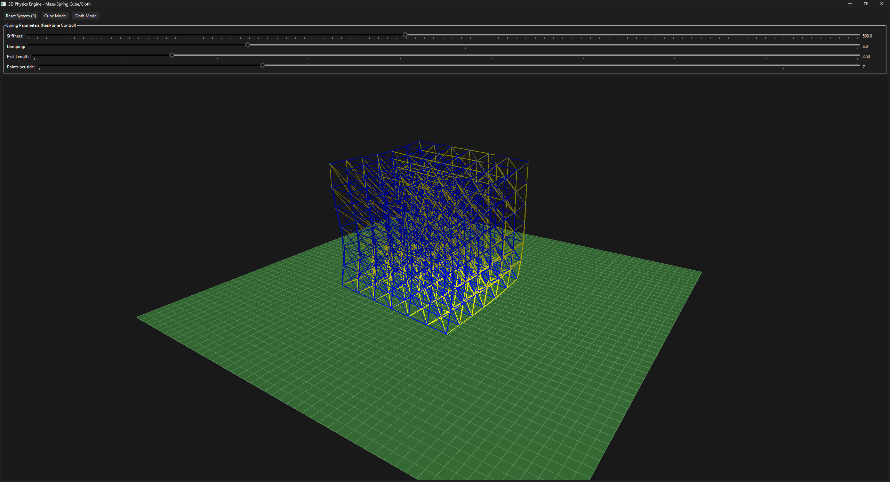
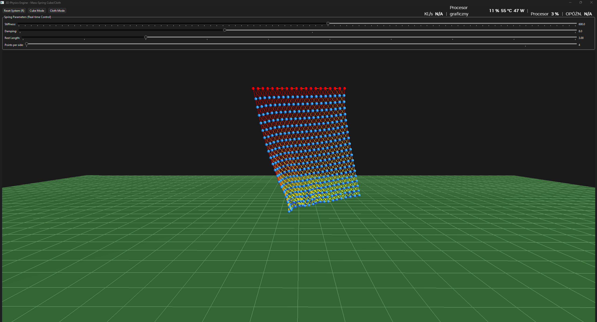

# Qt-3D-SpringMass-Engine

Prosty silnik fizyczny 3D napisany w C++ z użyciem Qt oraz OpenGL. Projekt symuluje układ masa-sprężyna (spring-mass system) – pozwala na tworzenie deformowalnej kostki 3D oraz płótna/tkaniny i wchodzenie z nimi w interakcję w czasie rzeczywistym.

| Tryb Kostki 3D | Tryb Płótna (Cloth) |
| :---: | :---: |
|  |  |

---

## Funkcje projektu

- **Dwa tryby obiektu:**
  - Deformowalna kostka 3D (siatka punktów połączona sprężynami).
  - Płótno / tkanina.
- **Interaktywność:**
  - Przeciąganie punktów myszką w przestrzeni 3D.
  - Obracanie i przybliżanie kamery.
- **Reakcja wizualna:**
  - Sprężyny zmieniają kolor (zielony -> żółty -> czerwony) w zależności od stopnia ich rozciągnięcia.
- **Fizyka i kolizje:**
  - Grawitacja, siły sprężystości (prawo Hooke'a) oraz tłumienie.
  - Odbicia od ścian, sufitu i podłoża.
- **Modyfikacja na żywo:**
  - Suwaki w GUI do zmiany sztywności sprężyn, tłumienia i długości spoczynkowej w trakcie trwania symulacji.

---

## Sterowanie

| Przycisk / Klawisz | Działanie |
| --- | --- |
| **Lewy przycisk myszy (LPM)** *(na punkcie)* | Chwycenie i przeciąganie wybranego punktu |
| **Lewy przycisk myszy (LPM)** *(w wolnym miejscu)* | Obracanie kamery wokół obiektu |
| **Kółko myszy** | Zoom (przybliżanie / oddalanie kamery) |
| **Klawisz R** | Reset symulacji do stanu początkowego |

---

## Jak uruchomić?

### W Qt Creatorze:
1. Otwórz plik `Qt-3D-SpringMass-Engine.pro` w **Qt Creator**.
2. Wybierz swój kompilator (Desktop GCC / MSVC / MinGW z obsługą OpenGL).
3. Kliknij **Run** (lub wciśnij `Ctrl + R`).

### Z terminala (qmake):
```bash
qmake Qt-3D-SpringMass-Engine.pro
make
./Qt-3D-SpringMass-Engine
```